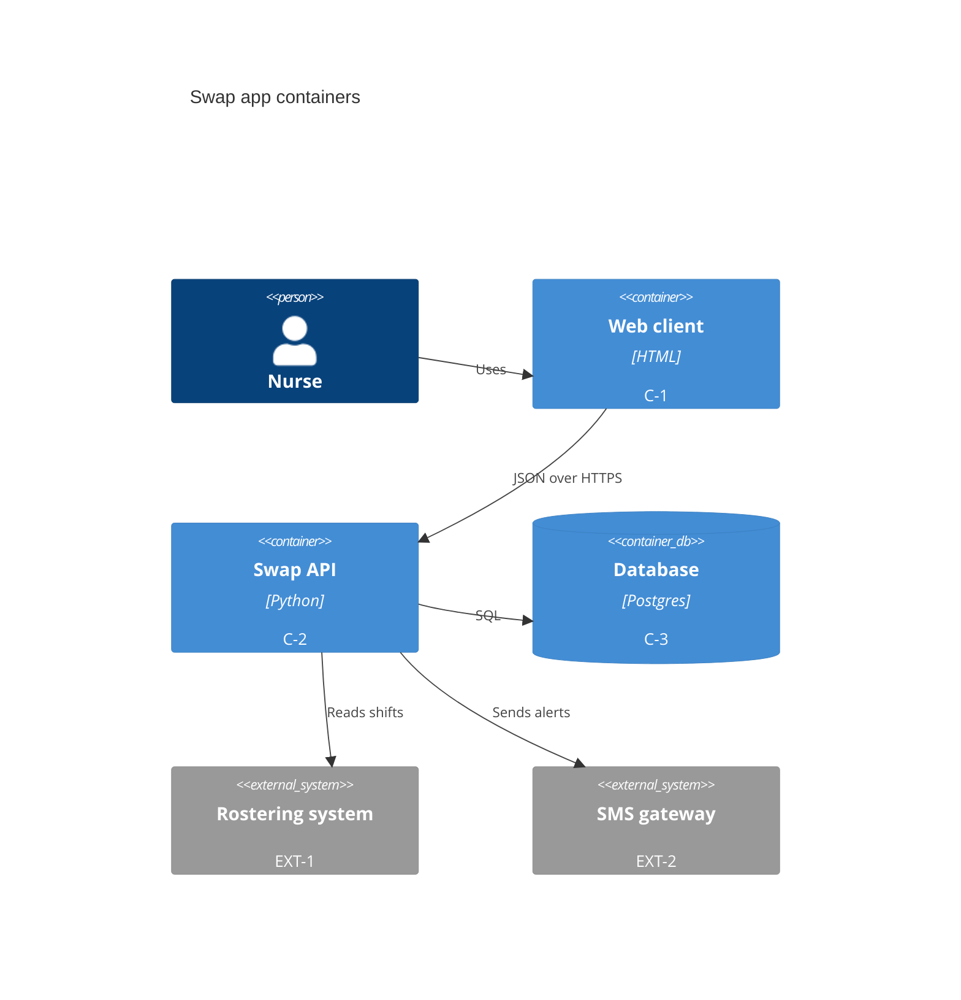
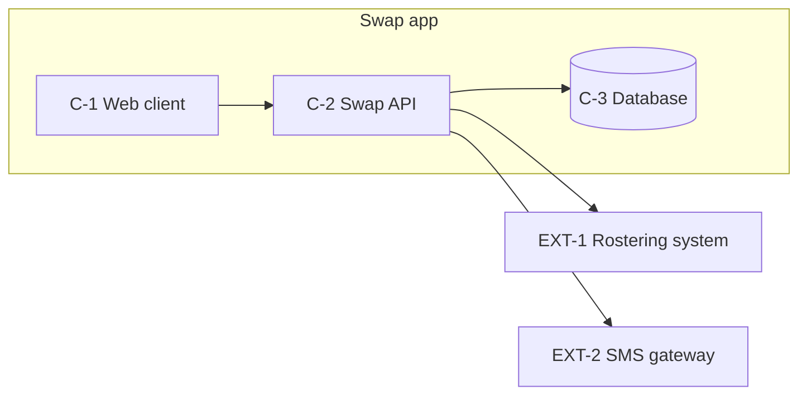

# Containers

## Containers

| id | name | technology | responsibility | data owned | interface |
|---|---|---|---|---|---|
| C-1 | Web client | HTML and a small script | shows the board | none | HTTPS |
| C-2 | Swap API | Python service | swap rules, alerts | none | JSON API |
| C-3 | Database | managed Postgres | swaps, staff | swaps, staff | SQL |

External systems: EXT-1 rostering system (read only), EXT-2 SMS gateway.

## How each quality goal is met

| QG | mechanism | containers | QAS | expected response |
|---|---|---|---|---|
| QG1 | queue swaps when the roster is down | C-2, C-3 | QAS-01 | posted within 5 s |
| QG2 | field-level encryption of phone numbers | C-3 | QAS-02 | no plain numbers |
| QG3 | server-rendered pages | C-1 | QAS-03 | under 2 s |
