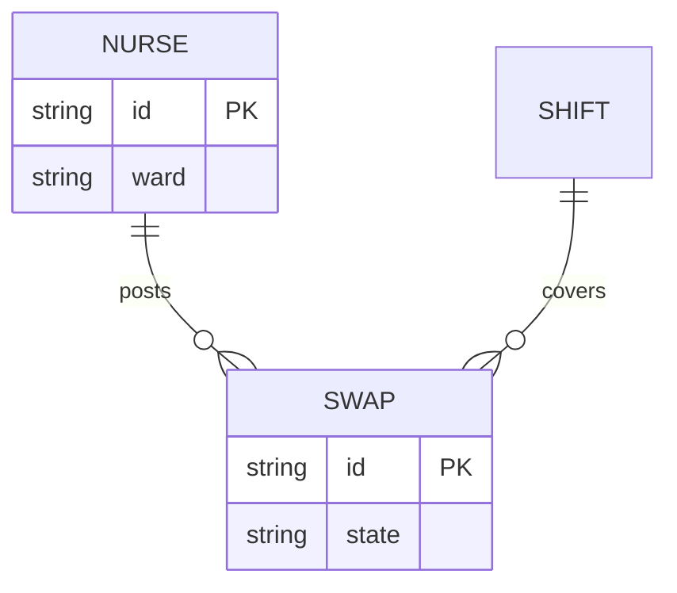

# Data model

## Entities

| entity | fields | owner container | retention | PII |
|---|---|---|---|---|
| NURSE | id, ward, phone | C-3 | while employed | yes |
| SWAP | id, state, shift | C-3 | 2 years | no |
