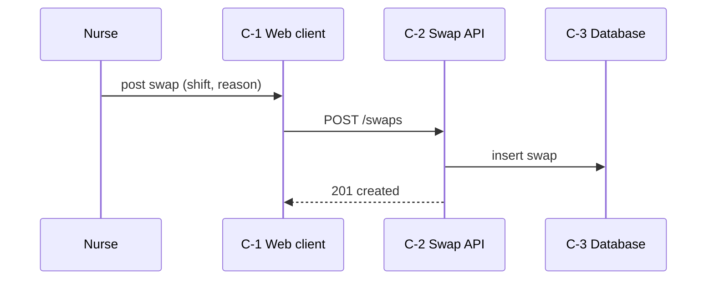
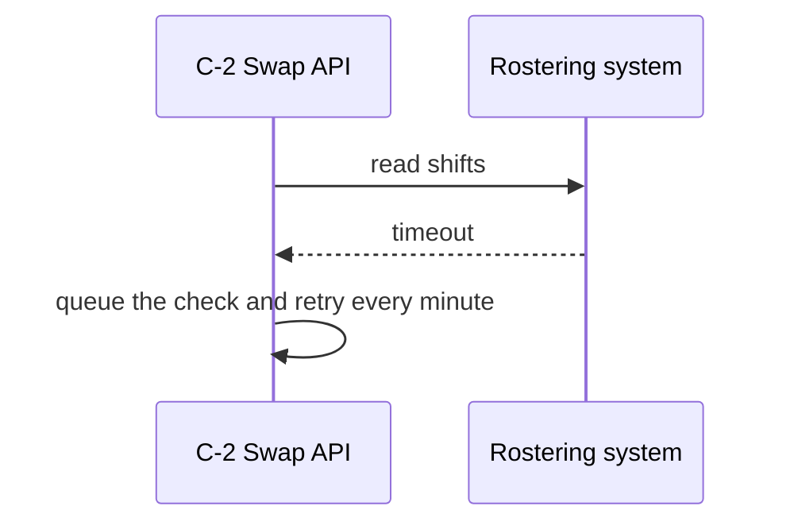

# Runtime

## F-1 Post a swap

```mermaid
sequenceDiagram
  participant N as Nurse
  participant W as C-1 Web client
  participant A as C-2 Swap API
  participant D as C-3 Database
  N->>W: post swap (shift, reason)
  W->>A: POST /swaps
  A->>D: insert swap
  A-->>W: 201 created
```

## F-2 Failure and recovery: roster system down

```mermaid
sequenceDiagram
  participant A as C-2 Swap API
  participant R as Rostering system
  A->>R: read shifts
  R-->>A: timeout
  A->>A: queue the check and retry every minute
```

The swap stays pending until the roster answers; the nurse sees a pending badge.
