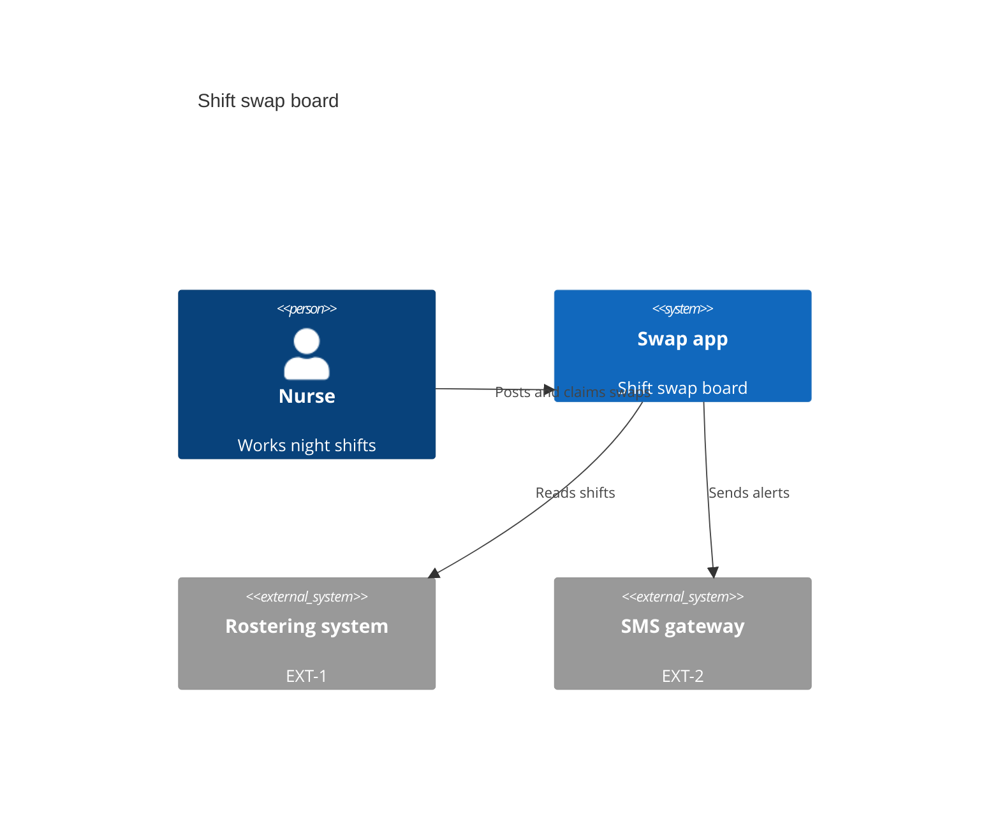
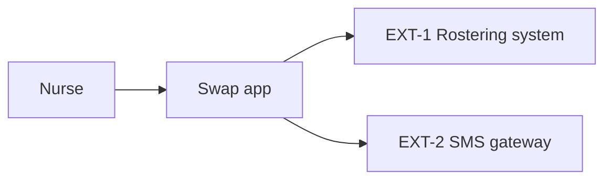

# Context

## System context

The swap app sits between nurses, the hospital rostering system and an SMS gateway.

## Actors

- ACT-1 Nurse: works night shifts.

## External systems

| id | name | description | relationship |
|---|---|---|---|
| EXT-1 | Rostering system | Hospital roster | reads shifts |
| EXT-2 | SMS gateway | Sends texts | sends alerts |
