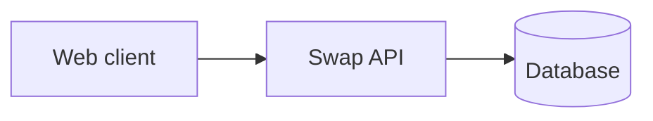

# One-pager: shift swap board

## Problem

Night nurses settle shift swaps by phone and chat, which costs sleep.

## Solution

A board where a nurse posts a shift and a colleague claims it; the ward manager approves.

## Why now

Hospitals already run single sign-on for staff.

## Who

Night-shift nurses and their ward managers.

## Differentiation

Night-first approval flow.

## Architecture at a glance

## MVP

Post, claim and approve on one ward.

## Roadmap

Milestone 0 probe, then a three-ward pilot.

## Budget

About $420 a month at pilot scale.

## Top risks

- Roster export missing: test by asking IT for a sample export.
- SMS cost growth: test with a cost cap.
- Low adoption: test with the Milestone 0 probe.

## Metrics

Swaps posted per week; unfilled night shifts.

## The ask

Two developers for ten weeks.
