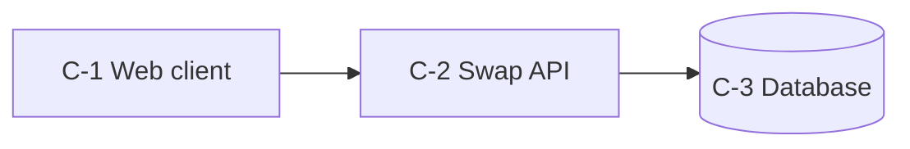

# Proposal: shift swap board for night-shift nurses

Status: DRAFT

## 1. Executive Summary

Night-shift nurses lose time and sleep arranging shift swaps by phone. We propose a shift swap board where a nurse
posts a shift and a qualified colleague claims it, with the ward manager approving in one tap. The first milestone
runs the pre-registered probe before any build. We are not building payroll or a native app.

## 2. Problem and Evidence

Night nurses arrange swaps through calls and group chats. In a survey, 62% of night nurses said a swap takes more than
a day to settle [S-001]. The status quo costs sleep and leads to unfilled shifts. Existing tools target day rosters
[S-002]. Every nurse in the pilot has a smartphone [ASSUMPTION: nurses have smartphones on shift].

## 3. Solution

A nurse opens the board, posts the shift she cannot work, and gets an alert when a colleague claims it. The ward
manager approves or declines. Nobody has to call anyone at night.

## 4. Users and Market

The first segment is night-shift nurses in EU hospitals who swap at least once a month. Ward managers are approvers,
not users. A bottom-up size is 300 nurses in the pilot hospital [ESTIMATE: 250-350; one hospital's night roster].

## 5. Differentiation vs Prior Art

| alternative | what it does | gap |
|---|---|---|
| Group chats | informal swaps | no approval trail |
| Day roster tools | full rostering | no night-first flow |

Our honest moat is the approval flow tuned to wards; it is easy to copy.

## 6. Architecture Summary

We chose candidate A, a modular monolith on managed services (ADR-0001, ADR-0002). Alternatives considered: an
event-driven design scored lower on operational simplicity.

## 7. Scope and MVP

In scope: posting, claiming and approving swaps on one ward. Out of scope: payroll and native apps. Non-goals:
replacing the roster system.

## 8. Roadmap and Milestones

- Milestone 0: run the pre-registered probe on one ward for two weeks; kill criterion: fewer than five swaps posted.
- Milestone 1: pilot on three wards. Exit when swaps settle within a shift.
- Milestone 2: decide on a native app (see deferred decisions).

## 9. Team and Effort

Two developers and a part-time ward liaison. Effort is 6 to 10 person-weeks with medium confidence, most of it human
work on the roster integration.

## 10. Budget and Cost

The monthly run cost at the MVP scale is $420, rising to $2,100 at ten times the users [ESTIMATE: from the cost model;
SMS dominates]. The build costs 6 to 10 person-weeks [ESTIMATE: two developers; roster integration is the unknown].

## 11. Risks and Mitigations

The top risk is R-001: the roster export may not exist; the fallback is a CSV import. R-002 covers SMS cost growth.

## 12. Success Metrics and Validation Plan

Leading metric: swaps posted per week. Lagging metric: unfilled night shifts. The cheapest test of the load-bearing
assumption is the Milestone 0 probe.

## 13. Open Questions

- Which roster export exists? Owner: tech lead. Decide by: Milestone 0.
- Who signs the data processing agreement? Owner: hospital IT. Decide by: Milestone 1.

## Appendix A. ADR Index

- ADR-0001 Use a managed Postgres database (proposed)
- ADR-0002 Use a managed job queue for SMS alerts (proposed)

## Appendix B. Assumptions Index

See assumptions.md.

## Appendix C. Candidate Comparison

Candidate A led the matrix with a clear lead.

## Appendix D. Idea Selection Record

The idea won the tournament on debiased standings.

## Appendix E. Glossary

- Swap: one nurse gives a shift to another.

## Appendix F. Sources

- S-001 Night nurse survey
- S-002 Shift swap tools
